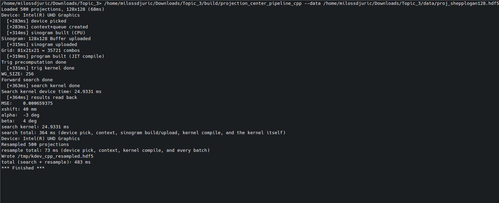

# gpulab-topic3-projection-center

CIS GPU Lab course project, Topic 3-4: Projection Center Searching and
Resampling. This project implements the two reference tasks:

- projection center (forward) searching
- projection resampling

Cone-beam CT (CBCT) reconstruction needs an accurate detector center of
rotation (COR); a misaligned center produces reconstruction artifacts. This
project finds the true center via a GPU-accelerated symmetry-based grid
search, then uses the found pose to resample the raw projections as if
captured by a centered detector.

## What Changed

The original reference scripts (`Topic_3_forwardsearching.py`,
`Topic_3_resampling.py`, kept unmodified in `reference/`) are plain Python:
one loop over every candidate pose, one loop over every pixel. Both are slow.

`projection-center-cpp/` (this repo's own C++ implementation) replaces the slow
parts with GPU kernels:

- searching: one GPU work-group per candidate pose
- resampling: one GPU work-item per output pixel

That's a large jump in parallelism over the reference's serial loops. See
"Benchmark Results" below for the actual numbers.

## Reports & Documentation

Longer write-ups live as PDFs under `repo_docs/`:

- **`repo_docs/benchmark-report.pdf`**: `opencl` vs `cpp` timing on both
  datasets (10 repeats each), plus how much faster both are than the raw
  reference.
- **`repo_docs/optimizations-report.pdf`**: the performance work behind
  those numbers: eliminating redundant `tan()`/`atan()` calls, fixing a
  missing `-O3`/`release` compile flag, resample buffer/kernel caching,
  and a `--batch-size` sweep, each fix measured before/after.
- **`repo_docs/running.pdf`**: a practical command reference: setup, the
  search/resample/pipeline command for every backend (`opencl`/`cpu`/`cpp`),
  the pybind11 Python interface, the reference, validation, benchmarks. Its
  source is `repo_docs/running.html`: edit that, then regenerate the PDF with
  the command in its header comment.
- **`repo_docs/pybind-interface.md`**: how to run the course-required Python
  interface (pybind11 / `torch.utils.cpp_extension`): requirements, the
  one-command example, calling it from your own code, function reference,
  tests, timing, troubleshooting. See "Python Interface (pybind11)" below.
- **`repo_docs/kdevelop-setup.pdf`**: the same KDevelop steps as the
  section below.
- **`repo_docs/windows-support.pdf`**: Windows build/run status, see the
  Windows section below.

## Repository Layout

```text
.
|-- data/                            (gitignored, populate locally)
|   |-- proj_shepplogan128.hdf5
|   `-- proj_shepplogan512.hdf5
|-- reference/                        untouched CPU reference implementation
|   |-- Topic_3_forwardsearching.py
|   |-- Topic_3_resampling.py
|   `-- run_reference_pipeline.py     runs both of the above, one command
|-- projection-center-cpp/                   this repo's C++/OpenCL implementation
|   |-- backend.py                     pybind11 Python interface: `from backend import _backend`
|   |-- run_pybind.py                  Python reads HDF5 -> _backend.search/resample -> writes HDF5
|   |-- src/
|   |   |-- forward_search.cpp/.hpp     forward search host code
|   |   |-- resample.cpp/.hpp           resampling host code
|   |   |-- ported_backends.cpp/.hpp    C++ ports of the opencl + cpu backends (pybind only)
|   |   |-- pybind_backend.cpp          the pybind11 module (search, resample)
|   |   |-- stage_timing.hpp            the shared read/compute/write timing line
|   |   `-- main.cpp / resample_main.cpp / pipeline_main.cpp  CLI entrypoints
|   |-- kernels/*.cl                   OpenCL C kernels
|   |-- tests/                         smoke + CLI-vs-backend + ported-backend regression tests
|   `-- README.md
|-- projection-center-python-opencl/                fetched Python/PyOpenCL implementation
|   |-- pyproject.toml
|   |-- README.md
|   `-- src/projection_center_searching/
|       |-- backends.py                CpuBackend, OpenCLBackend, CppBackend
|       |-- cli.py                     the `projection-center` command
|       |-- geometry.py, hdf5_io.py, models.py, pipeline.py
|       |-- timing.py                  read/write time accounting for the timing line
|       `-- __init__.py, __main__.py
|-- docs/                             (gitignored)
|   |-- course/                        course-provided PDFs (exercise sheets, etc.)
|   `-- reports/                       our submitted report PDFs
|-- repo_docs/                        the report PDFs below, tracked in git
|   |-- benchmark-report.pdf           opencl vs cpp timing + reference speedup
|   |-- optimizations-report.pdf       performance investigation
|   |-- running.pdf                    practical how-to, all backends + pybind
|   |-- running.html                   source of running.pdf
|   |-- pybind-interface.md            how to run the pybind11 Python interface
|   |-- kdevelop-setup.pdf             KDevelop project setup guide
|   `-- windows-support.pdf            Windows build/run status
|-- benchmark_pybind.py              10x timing of every backend (pybind + CLI)
|-- scripts/
|   |-- run_all_128.sh                 full run against the 128px dataset
|   `-- run_all_512.sh                 full run against the 512px dataset
|-- meson.build                       root-level KDevelop build file (duplicates
|                                      projection-center-cpp/meson.build, see its own
|                                      comment for why it can't just include it)
|-- PROGRESS_REPORT.md                mid-term progress report (source; PDF in docs/reports/)
`-- runs/                             (gitignored) validation run outputs/logs
```

## Requirements

- Python 3.10 or newer, `numpy`, `h5py`, `pyopencl`, `mako`
- A C++17 compiler, Meson + Ninja, HDF5 C++ headers, Boost (`program_options`, JSON)
- An installed OpenCL runtime, plus the OpenCL C++ header (`opencl-clhpp-headers` on Ubuntu/Debian)
- For the pybind11 Python interface: `torch` (brings pybind11), `numpy`, `h5py`, `g++`, `ninja`; see "Python Interface (pybind11)"

`projection-center-cpp/`'s C++ dependencies are declared in `projection-center-cpp/meson.build`;
`projection-center-python-opencl/`'s Python dependencies in `projection-center-python-opencl/pyproject.toml`.

## Input Data

Two datasets, both under `data/` (gitignored, populate locally):

- `data/proj_shepplogan128.hdf5`: 128x128, 500 projections
- `data/proj_shepplogan512.hdf5`: 800x500, 1000 projections

Same HDF5 schema for both: `Projection`, `pixelSize`, `SDD`, `SOD`,
`voxelSize`, `Volumen_num_xz`, `Volumen_num_y`, `num_projs`,
`detector_width`, `detector_height`, `Angle`.

## Root Script Usage

`reference/Topic_3_forwardsearching.py` and `reference/Topic_3_resampling.py`
are the **untouched, serial CPU reference**, required to stay unmodified
per the course rubric, run as two separate steps:

```bash
python3 reference/Topic_3_forwardsearching.py --data data/proj_shepplogan128.hdf5
python3 reference/Topic_3_resampling.py --data data/proj_shepplogan128.hdf5
```

The second step has no `--pose` flag: it always reads the `./real_cb_pose.json`
the first step wrote.

On `proj_shepplogan128.hdf5` the first step stops with `UnboundLocalError`:
that's the reference's own known out-of-bounds bug, not something in this
repo. `run_reference_pipeline.py` below patches it in memory (the files on
disk stay untouched) and works on that dataset.

For both steps in one command, use `reference/run_reference_pipeline.py`.
It calls the same two unmodified reference functions directly instead of
running `Topic_3_resampling.py`'s own wrapper, which writes to a hardcoded
path that only works on the course's lab network:

```bash
python3 reference/run_reference_pipeline.py --data data/proj_shepplogan128.hdf5 --output-pose pose.json --output-data resampled.hdf5
```

For anything GPU-accelerated (or a faster vectorized CPU path), use the CLI
instead, see below.

## KDevelop Setup

1. **Open the project**: File → Open Project → the root `meson.build`.
2. **Configure & build**: right-click the project in the Projects sidebar →
   Open Configuration, confirm the Meson build directory is `build/` with
   the `ninja` backend, Apply. Click the project node to select it (Build
   stays greyed out otherwise), then Build → Build Project.
3. **Set up three launch configs** (Run → Configure Launches):

   **`projection_center_pipeline_cpp`** (type: Compiled Binary, mode: Executable)
   - Executable: `<project-root>/build/projection_center_pipeline_cpp` (absolute path, verified working)
   - Arguments: `--data data/proj_shepplogan128.hdf5 --search-kernel projection-center-cpp/kernels/forward_search.cl --resample-kernel projection-center-cpp/kernels/resample.cl --output-pose /tmp/kdev_cpp_pose.h5 --output-data /tmp/kdev_cpp_resampled.hdf5`
   - Working directory: the project root

   **`projection_center_pipeline_opencl`** (type: Script Application)
   - Interpreter: your `python3`
   - Script: your `projection-center` executable
   - Arguments: `pipeline --backend opencl --data data/proj_shepplogan128.hdf5 --output-pose /tmp/kdev_opencl_pose.json --output-data /tmp/kdev_opencl_resampled.hdf5`
   - Working directory: the project root

   **`projection_center_pipeline_reference`** (type: Script Application)
   - Interpreter: your `python3`
   - Script: `<project-root>/reference/run_reference_pipeline.py` (absolute path, verified working)
   - Arguments: `--data data/proj_shepplogan128.hdf5 --output-pose /tmp/kdev_reference_pose.json --output-data /tmp/kdev_reference_resampled.hdf5`
   - Working directory: the project root

   Use full paths for the two fields marked above, that's what actually
   worked when we tested it. Everything else can be relative to the
   project root. The cpp binary is called `projection_center_pipeline_cpp`.
   If you just pulled this change, rebuild first (Build → Build Project) so
   that file actually exists before you point the Executable field at it.

4. **Run one**: Run → Current Launch Configuration → pick one, then Run →
   Execute (`Shift+F9`). cpp and opencl finish in seconds; reference takes
   about 5 to 6 minutes. That's expected, not a hang.

Example output from `projection_center_pipeline_cpp`, run this way:



Full version of this guide: `repo_docs/kdevelop-setup.pdf`.

## CLI Usage

Once `projection-center-python-opencl/` is installed (see "OpenCL Setup" at the bottom of
this file), one command does everything:

```bash
projection-center devices                                                                # list GPUs
projection-center search --data data/proj_shepplogan128.hdf5 --output-pose pose.json     # find the pose
projection-center resample --data data/proj_shepplogan128.hdf5 --pose pose.json --output-data out.hdf5  # apply a pose
projection-center pipeline --data data/proj_shepplogan128.hdf5 --output-pose pose.json --output-data out.hdf5  # both, one command
```

### Backend Selection

Add `--backend opencl` (default), `--backend cpu`, or `--backend cpp` to any
command above to pick which implementation runs it. All three find the same
pose and produce matching resampled output.

## Python Interface (pybind11)

The course requires the OpenCL code to be callable from Python through
`torch.utils.cpp_extension` + pybind11: Python reads the data, passes it into
the interface, and gets the results back. `projection-center-cpp/` provides
this, laid out like the course's `pybindextension.zip` example (`backend.py`
next to a `src/` folder). No build step: the first import compiles the module
and caches it.

How it maps to the course's example:

| `pybindextension.zip` | `projection-center-cpp/` |
|---|---|
| `backend.py`: `_backend = load(name='add_test', sources=[src/add_test.cpp])` | `backend.py`: `_backend = load(name="forward_search_backend", sources=[src/pybind_backend.cpp, ...])`, plus `-lOpenCL`, the kernel folder and `-O3` |
| `src/add_test.cpp`: `PYBIND11_MODULE(add_test, m)`, `m.def("add", ...)` | `src/pybind_backend.cpp`: `PYBIND11_MODULE(forward_search_backend, m)`, `m.def("search", ...)`, `m.def("resample", ...)` |
| `from backend import _backend`, then `_backend.add(0.2)` | `from backend import _backend`, then `_backend.search(...)` and `_backend.resample(...)` |

Python reads the HDF5 file, passes the NumPy arrays into `_backend`, and gets
the pose (a dict) and the resampled projections (a NumPy array) back; the C++
side never opens a file.

Needs:

- Python: `torch` (which also brings the pybind11 headers; a CPU-only build
  is enough), `numpy`, `h5py`: `python3 -m pip install torch numpy h5py`
- `g++` and `ninja`, which `torch.utils.cpp_extension` compiles with
- OpenCL: the C++ header `CL/opencl.hpp`, the loader library, and a GPU
  driver. On Ubuntu/Debian: `sudo apt install opencl-clhpp-headers
  ocl-icd-opencl-dev` plus your vendor driver (e.g. `intel-opencl-icd`)

No HDF5 or Boost development packages are needed for this part: Python does
all the file reading and writing.

Run the whole flow (read HDF5 -> search -> resample -> write HDF5):

```bash
cd projection-center-cpp
python3 run_pybind.py --data ../data/proj_shepplogan128.hdf5
```

All `run_pybind.py` commands below are run from inside
`projection-center-cpp/`. From the repo root, use
`python3 projection-center-cpp/run_pybind.py --data data/proj_shepplogan128.hdf5`
instead.

This writes the found pose to `runs/real_cb_pose.h5` and the corrected
projections to `runs/projs_resample.h5`. Every backend prints the same
report: the stage log (device, sinogram, grid, kernel times), the pose,
`search total`, `resample total`, and at the end

```text
timing (excluding imports): read 41 ms | compute 570 ms | write 71 ms | I/O 112 ms | compute+I/O 682 ms
total run: 7.0 s (including import and file I/O)
```

plus the one-off `import (torch + pybind module load)` time at the start
(~5 s, mostly `import torch`). The very first run also compiles the module
(about 40 s here); later runs reuse the compiled copy. The `No CUDA runtime is found` warning is
harmless, ignore it.

Other datasets:

```bash
python3 run_pybind.py --data ../data/proj_shepplogan512.hdf5    # 512px
```

Other backends:

```bash
python3 run_pybind.py --data ../data/proj_shepplogan128.hdf5 --backend opencl
python3 run_pybind.py --data ../data/proj_shepplogan128.hdf5 --backend cpu
```

Search only:

```bash
python3 run_pybind.py --data ../data/proj_shepplogan128.hdf5 --skip-resample
```

Every backend on both datasets, from the repo root:

```bash
# 128px dataset
python3 projection-center-cpp/run_pybind.py --data data/proj_shepplogan128.hdf5 --backend cpp
python3 projection-center-cpp/run_pybind.py --data data/proj_shepplogan128.hdf5 --backend opencl
python3 projection-center-cpp/run_pybind.py --data data/proj_shepplogan128.hdf5 --backend cpu

# 512px dataset
python3 projection-center-cpp/run_pybind.py --data data/proj_shepplogan512.hdf5 --backend cpp
python3 projection-center-cpp/run_pybind.py --data data/proj_shepplogan512.hdf5 --backend opencl
python3 projection-center-cpp/run_pybind.py --data data/proj_shepplogan512.hdf5 --backend cpu
```

Each run writes to `runs/real_cb_pose.h5` and `runs/projs_resample.h5`, so
the next run overwrites them. To keep all six results, give each run its own
output names:

```bash
python3 projection-center-cpp/run_pybind.py --data data/proj_shepplogan128.hdf5 --backend cpp    --output runs/pybind/128_cpp_pose.h5    --resample-output runs/pybind/128_cpp_resampled.h5
python3 projection-center-cpp/run_pybind.py --data data/proj_shepplogan128.hdf5 --backend opencl --output runs/pybind/128_opencl_pose.h5 --resample-output runs/pybind/128_opencl_resampled.h5
python3 projection-center-cpp/run_pybind.py --data data/proj_shepplogan128.hdf5 --backend cpu    --output runs/pybind/128_cpu_pose.h5    --resample-output runs/pybind/128_cpu_resampled.h5
python3 projection-center-cpp/run_pybind.py --data data/proj_shepplogan512.hdf5 --backend cpp    --output runs/pybind/512_cpp_pose.h5    --resample-output runs/pybind/512_cpp_resampled.h5
python3 projection-center-cpp/run_pybind.py --data data/proj_shepplogan512.hdf5 --backend opencl --output runs/pybind/512_opencl_pose.h5 --resample-output runs/pybind/512_opencl_resampled.h5
python3 projection-center-cpp/run_pybind.py --data data/proj_shepplogan512.hdf5 --backend cpu    --output runs/pybind/512_cpu_pose.h5    --resample-output runs/pybind/512_cpu_resampled.h5
```

Expected pose on every backend: 40 mm / −3° / 4° on 128px, 35 mm / −1° / 10°
on 512px.

Or from your own Python code (from inside `projection-center-cpp/`):

```python
import h5py
from backend import _backend

with h5py.File("../data/proj_shepplogan128.hdf5", "r") as f:
    projs = f["Projection"][()]
    SDD, SOD, pixel_size = f["SDD"][()], f["SOD"][()], f["pixelSize"][()]
H, W = projs.shape[1:]

pose = _backend.search(projs, SDD, SOD, pixel_size, W, H,
                       xshift=40.0, alpha=10.0, beta=10.0,              # ± range: mm, deg, deg
                       xshift_step=1.0, alpha_step=1.0, beta_step=1.0)
out = _backend.resample(projs, SDD, SOD, pixel_size,
                        xshift=pose["xshift"], alpha=pose["alpha"], beta=pose["beta"],
                        center_x=pose["center_x"], center_y=pose["center_y"])
corrected = out["projections"]    # numpy array, (num_projs, H, W)
```

Both functions take `backend="cpp"` (default: our own OpenCL kernels),
`"opencl"` (the Python package's OpenCL kernels, run from C++) or `"cpu"`
(the Python package's NumPy CPU backend, ported to C++). All three give the
same pose.

Tests, from `projection-center-cpp/`, each printing `... PASS`:

```bash
python3 tests/test_backend_smoke.py              # the module builds, loads and finds a sane pose
python3 tests/test_ported_backends.py            # backend="opencl"/"cpu" give bit-identical results to
                                                 # projection-center-python-opencl's own opencl/cpu backends
                                                 # (needs that package installed, see "OpenCL Setup")

# these two compare against the C++ command-line programs, so build those first:
#   meson setup builddir && meson compile -C builddir
python3 tests/test_cli_vs_backend.py             # pybind search == command-line search
python3 tests/test_resample_cli_vs_backend.py    # pybind resample == command-line resample, bit-identical
```

Timing: `python3 benchmark_pybind.py` from the repo root.

Full manual (every option, function reference, troubleshooting):
`repo_docs/pybind-interface.md`.

## Output Files

Same schema regardless of which backend produced them:

- **Pose JSON**: `center_point` (2-element), `xshift`, `alpha`, `beta`,
  `MSE`, and `kernel_ms` if that backend reports device-side kernel timing
- **Resampled HDF5**: updated `pixelSize`/`SDD`/`SOD`, preserved
  angle/volume metadata, the resampled `Projection` stack

## Parallelization Details

Search: one GPU work-group per candidate pose, with a tree reduction across
sampled angles to get that candidate's error score.

Resample: one GPU work-item per output pixel.

## Optimizations

- **Moving the work onto the GPU in the first place.** By far the biggest
  win. Instead of checking one candidate pose at a time and fixing one
  pixel at a time like the reference does, the GPU checks many candidates
  and fixes many pixels all at once. That's what gets you the 200x to 701x
  numbers in "Benchmark Results". Everything below is smaller tuning on top
  of that.

Smaller fixes on top of that:

- **Less repeated trig math in search.** The search kernel used to
  recompute the same `tan()`/`atan()` math for every single candidate,
  about 71 million calls total. Most of that was the exact same
  calculation done over and over, so it's now computed once and reused,
  and one of the two functions (`atan()`) turned out to be unnecessary
  entirely. About 1.6x faster on the search kernel alone.
- **A missing compiler optimization flag.** The build was accidentally
  compiling without optimizations turned on. Turning them on made one
  CPU-side step about 240x faster (11.4s down to well under a second). The
  same mistake existed in a second, separate build path and got the same
  fix.
- **Reusing GPU memory instead of recreating it.** Resample used to set up
  fresh GPU memory on every single batch instead of reusing it. Reusing it
  took resample from 48 seconds down to about 4, roughly 12x faster.
- **Combining search and resample into one program.** Running them as two
  separate programs means paying startup costs (loading the file, setting
  up the GPU) twice. Running them as one program instead removes that
  duplicate cost.
- **A backend that mixes and matches.** Whether cpp or opencl has the
  faster search turns out to depend on the dataset. The `hybrid` backend
  lets you use cpp for search and opencl for resample together, picking
  whichever is better for each half.
- **Checked if a different resample batch size would help.** Tried several
  different sizes. The one already being used by default turned out to
  already be close to the best option, so nothing needed to change.

Full before/after measurements for the first four: `repo_docs/optimizations-report.pdf`.

## Test System

All numbers in "Benchmark Results" below were measured on the same
machine, back to back, nothing else competing for CPU or GPU:

| Component | Detail |
|---|---|
| CPU | Intel Core i7-10510U @ 1.80GHz, 4 cores / 8 threads, up to 4.9GHz boost |
| RAM | 62GiB |
| GPU | Intel UHD Graphics (CometLake-U GT2), OpenCL 3.0 NEO, driver 23.43.027642, 24 compute units, max work-group 256 |
| OS | Ubuntu 24.04.4 LTS, kernel 7.0.0-31-generic |
| Disk | NVMe SSD, 468GB |

## Benchmark Results

Ten repeated runs per backend, per dataset.

| Dataset | opencl time | cpp time | opencl speedup | cpp speedup |
|:---|---:|---:|---:|---:|
| 128px | 1.64s | 1.52s | 200x | 215x |
| 512px | 7.26s | 8.72s | 701x | 583x |

Speedup is each backend's mean time against the raw Python reference's mean
time on the same dataset (327.10s at 128px, 5086.14s at 512px, from the
table above).

Individual runs, all values in seconds:

| Run | 128px reference | 128px opencl | 128px cpp | 512px reference | 512px opencl | 512px cpp |
|---|---|---|---|---|---|---|
| 0 | 336.09 | 1.95 | 1.74 | 4981.44 | 6.72 | 8.93 |
| 1 | 329.93 | 1.83 | 1.84 | 4971.42 | 7.64 | 8.81 |
| 2 | 322.56 | 1.52 | 1.90 | 5257.49 | 7.03 | 8.78 |
| 3 | 324.91 | 1.53 | 1.78 | 4997.76 | 8.30 | 8.57 |
| 4 | 319.89 | 1.56 | 1.38 | 5378.50 | 7.77 | 8.65 |
| 5 | 334.61 | 1.51 | 1.44 | 5014.68 | 7.02 | 8.87 |
| 6 | 326.64 | 1.61 | 1.14 | 5071.89 | 7.11 | 8.59 |
| 7 | 323.24 | 1.54 | 1.25 | 5050.91 | 6.86 | 8.47 |
| 8 | 328.17 | 1.75 | 1.40 | 5044.57 | 6.73 | 8.93 |
| 9 | 324.91 | 1.59 | 1.33 | 5092.70 | 7.40 | 8.65 |

Which of `opencl`/`cpp` wins flips depending on dataset size. See
`repo_docs/benchmark-report.pdf` for the full investigation into why,
including a `strace` level look at where the time actually goes.

## Example End-to-End Commands

```bash
projection-center pipeline --data data/proj_shepplogan128.hdf5 --output-pose runs/pipeline/128/pose.json --output-data runs/pipeline/128/resampled.hdf5

projection-center pipeline --data data/proj_shepplogan512.hdf5 --output-pose runs/pipeline/512/pose.json --output-data runs/pipeline/512/resampled.hdf5
```

## Verification

Recommended checks:

1. `projection-center devices`
2. `projection-center search --backend opencl --data data/proj_shepplogan128.hdf5`
3. Repeat with `--backend cpp` and `--backend cpu`, confirm the same pose
4. `projection-center resample --data data/proj_shepplogan128.hdf5 --pose pose.json --output-data out.hdf5`
5. Inspect the generated JSON and HDF5 outputs

## Limitations

- `--mode image` crashes on this dev machine's Intel iGPU driver (a driver
  bug, not something in this project's code); `--mode buffer`, the
  default, is unaffected and is what's actually validated.
- `--backend cpp` doesn't support `--platform-index`/`--device-index` (it
  always picks the first GPU) or a non-default `--sample-count`/
  `--sample-angle-range`; `projection-center-cpp/`'s own CLI hardcodes those.
- On the small `proj_shepplogan128.hdf5` dataset, the found `xshift` sits on
  the edge of its search range rather than settling at a clean interior
  value, a property of that phantom's own symmetry, not a bug in either
  implementation.

## OpenCL Setup

You need both an installed OpenCL runtime and, for `projection-center-python-opencl/`,
the Python package.

### Linux

Install your vendor OpenCL loader, the OpenCL C++ header and the runtime
first (e.g. Ubuntu/Debian: `ocl-icd-opencl-dev`, `opencl-clhpp-headers`, plus
the vendor runtime package, `intel-opencl-icd` for Intel iGPUs). Then:

```bash
# C++ side
cd projection-center-cpp
meson setup builddir && meson compile -C builddir
cd ..

# Python side
cd projection-center-python-opencl
python3 -m pip install -e .
cd ..
```

### Windows

The C++ build is verified working on native Windows via MinGW-w64
(MSYS2), confirmed by CI. Actually running it against real data isn't
verified yet, GitHub's Windows CI runners don't have a usable OpenCL
device, only that it compiles and links. `projection-center`'s Python side
(it depends on `pyopencl`) hasn't been touched for Windows at all yet.

```bash
# from an MSYS2 MINGW64 shell
pacman -S --needed mingw-w64-x86_64-toolchain mingw-w64-x86_64-meson \
  mingw-w64-x86_64-ninja mingw-w64-x86_64-hdf5 mingw-w64-x86_64-boost \
  mingw-w64-x86_64-opencl-headers mingw-w64-x86_64-opencl-icd

# MSYS2's opencl-headers package doesn't include the C++ bindings header
# projection-center-cpp/ uses, fetch it once:
curl -sSL -o /mingw64/include/CL/opencl.hpp \
  https://raw.githubusercontent.com/KhronosGroup/OpenCL-CLHPP/main/include/CL/opencl.hpp

cd projection-center-cpp
meson setup builddir
meson compile -C builddir
```

Produces `builddir/forward_search.exe` and
`builddir/forward_search_resample.exe`. For `--backend cpp` through the
Python CLI, install `projection-center-python-opencl` with a normal
Windows Python (not MSYS2's), and put MinGW's runtime DLLs on `PATH`:

```bash
pip install -e projection-center-python-opencl
set PATH=C:\msys64\mingw64\bin;%PATH%
projection-center devices
```

Full command reference and what's still open (no Windows port of
`scripts/run_all_128.sh`/`scripts/run_all_512.sh`, MinGW-w64 only, not
MSVC): `repo_docs/windows-support.pdf`.

## Parallelization Strategies Explored

This isn't just one GPU port with a couple of flags. A few genuinely
different approaches were tried, mostly in `projection-center-cpp/`:

- **Two ways of reading the sinogram on the GPU.** `--mode image` lets
  the GPU's own hardware do bilinear interpolation. `--mode buffer` does
  that same interpolation by hand in the kernel instead. Two different
  memory setups for the same computation.
- **Two kernels instead of one.** One kernel works out the trig values
  every candidate needs, once. A second kernel then scores every
  candidate using those values, with many GPU threads cooperating on
  each candidate's score.
- **Tuned, not left on defaults.** How many threads work together per
  candidate, and how many images get sent to the GPU per batch during
  resample, were both measured and adjusted, not just left as whatever
  the first working value was. See `repo_docs/optimizations-report.pdf`.
- **A separate Python/OpenCL implementation.** `projection-center-python-opencl/` is a
  second, independent GPU implementation, written in Python with
  PyOpenCL instead of C++, not a wrapper around the same code, and
  confirmed to give the same answer.
